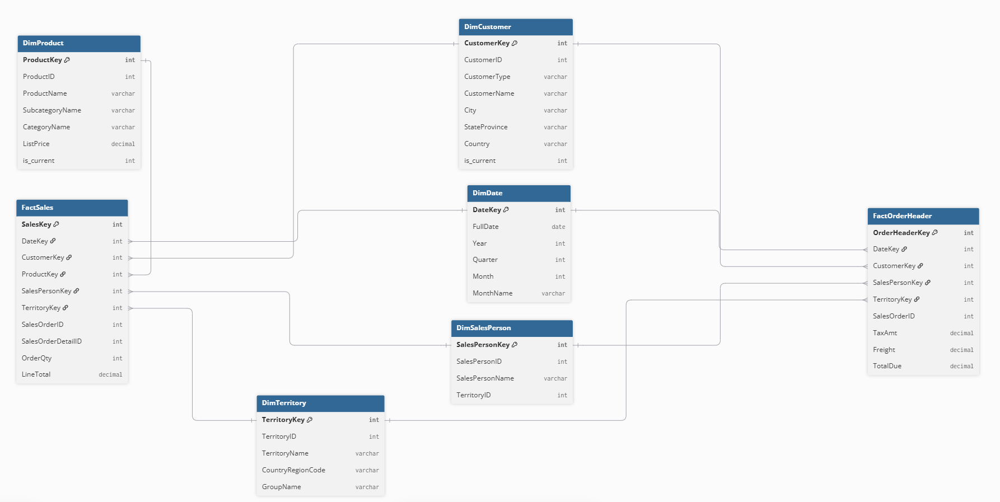

# AdventureWorks Data Warehouse Project

An end-to-end data warehouse project built on AdventureWorks OLTP, 
covering design, ETL, star schema modelling, and cloud migration.

## Project Scope

- **Source**: AdventureWorks2019 OLTP (SQL Server)
- **Target**: AdventureWorksDW (SQL Server → Azure)
- **Modelling**: Star Schema with two fact tables (Constellation Schema)
- **SCD Strategy**: Type 2 for DimCustomer and DimProduct

## Tech Stack

| Layer | Technology |
|-------|-----------|
| Source | SQL Server 2019 (AdventureWorks2019 OLTP) |
| Orchestration | Azure Data Factory (with Self-Hosted Integration Runtime) |
| Storage | Azure Data Lake Storage Gen2 (**raw / curated / gold** / logs) |
| Compute | Azure Databricks (Serverless, PySpark) |
| Storage Format | Parquet (raw) + Delta Lake (**curated + gold**) |
| Governance | Unity Catalog (Storage Credential + External Location) |
| Local DW | SQL Server (AdventureWorksDW) |
| Modelling | Star Schema (Constellation), SCD Type 2 |
| Architecture | **Medallion (Bronze → Silver → Gold)** |

## Repository Structure

| Folder | Purpose |
|--------|---------|
| `01-design/` | ERD, design decisions, grain definitions |
| `02-ddl/` | CREATE TABLE scripts for all DW objects |
| `03-etl/` | T-SQL scripts for loading dimensions and facts |
| `04-azure/` | ADF pipelines and Databricks PySpark notebooks |
| `05-validation/` | Reconciliation and data quality queries |
| `06-docs/` | Data dictionary and lessons learned |

## Design Summary

- **FactSales** (grain: order line) — measures: OrderQty, UnitPrice, LineTotal
- **FactOrderHeader** (grain: order) — measures: TaxAmt, Freight, TotalDue
- **Dimensions**: DimDate, DimCustomer, DimProduct, DimSalesPerson, DimTerritory

## Entity-Relationship Diagram

*Star Schema (Constellation) with 2 fact tables and 5 dimensions.*

## Key Design Decisions

- **Two fact tables (Constellation Schema)**: TaxAmt and Freight are order-level, 
  not line-level. Storing them in a line-level fact would cause double-counting.
- **SCD Type 2 for DimCustomer and DimProduct**: Customer addresses and product 
  prices change over time; Type 2 allows historical analysis.
- **Snowflake → Star for DimProduct**: Product → Subcategory → Category (3 levels) 
  merged into one table to avoid multi-table joins at query time.
- **Customer Type Handling**: 635 customers have both PersonID and StoreID (B2B 
  employees). Classified as Individual to avoid double-counting.
  Final: 19,119 Individual + 701 Store = 19,820.

For full details, see [06-docs/design-decisions.md](06-docs/design-decisions.md).

## Status

- [x] OLTP data exploration
- [x] Star schema design
- [x] DDL for all tables
- [x] Dimension loading (5 dimensions)
- [x] Fact loading (2 fact tables)
- [x] Data validation (reconciliation passed)
- [x] Azure migration (ADLS + ADF + Databricks)
- [x] PySpark transformations (Delta Lake)
- [x] Advanced PySpark (window functions, MERGE INTO, broadcast join)
- [x] Gold layer (4 aggregated tables)
- [x] Complete Medallion Architecture (Bronze → Silver → Gold)
- [ ] Power BI report

## Key Achievements

- Built an end-to-end data warehouse from AdventureWorks OLTP (60+ tables) 
  to a star schema with 2 fact tables and 5 dimensions
- Migrated the entire ETL pipeline to Azure: ADF extracts 14 source tables 
  to ADLS, Databricks (PySpark) transforms them into Delta Lake
- Validated row counts and totals against OLTP — 100% reconciliation
- Implemented SCD Type 2 with Delta Lake MERGE INTO
- Applied window functions (RANK, DENSE_RANK, ROW_NUMBER) and broadcast 
  joins for performance optimisation
- Configured Unity Catalog with Managed Identity for secure ADLS access
- Implemented a complete **Medallion Architecture** (Bronze → Silver → Gold) 
  on Azure Data Lake Storage: raw Parquet (Bronze), transformed Delta tables 
  (Silver), and aggregated KPI tables (Gold).

## Author

Yonggang Chen (Eddie)  
GitHub: [@Yonggang-Chen-1173486](https://github.com/Yonggang-Chen-1173486)